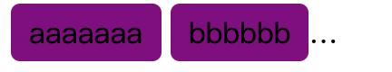

# css 好文
* [CSS的N个编码技巧](https://juejin.cn/post/6924206099193135111) (1. 九宫格图片展示 2.background-origin：content-box 3.蚂蚁行军边框 4.clip-path 5.伪类扩大可点击区域 6.毛玻璃效果 7.css fliter 8.动画属性 水波纹等)
* [解剖postCSS](https://mp.weixin.qq.com/s/RuSWiouxkVI87bbC-4sEtw)

# css-common
常用的css总结

### CSS 整块文本溢出省略方案



```javascript
<style>
.wrap {
   width: 200px;
    white-space: normal;
    overflow : hidden;
    text-overflow: ellipsis;
    display: -webkit-box;
    -webkit-line-clamp: 1;
    -webkit-box-orient: vertical;
}
.wrap span{
  display: inline-block;
  padding: 5px 10px;
  background-color: purple;
  border-radius: 5px; 
}
</style>
<div class='wrap'>
  <span>aaaaaaa</span>
  <span>bbbbbb</span>
  <span>vvvvvv</span>
  <span>hhhhhhh</span>
</div>
```

### 长度单位又可以分为相对长度单位和绝对长度单位

(1) 相对长度单位。相对长度单位又分为相对字体长度单位和相对视区长度单位。

* 相对字体长度单位，如 em 和 ex，还有 CSS3 新世界的 rem 和 ch(字符 0 的宽度)。
* 相对视区长度单位，如 vh、vw、vmin 和 vmax。

(2)绝对长度单位:最常见的就是 px，还有 pt、cm、mm、pc 等了解一下就可以，在我
看来，它们实用性近乎零，至少我这么多年一次都没用过。

### 选择器

* 伪类选择器:一般指前面有个英文冒号(:)的选择器，如:first-child 或:last-child 等。
* 伪元素选择器:就是有连续两个冒号的选择器，如::first-line::first-letter、::before 和::after。
* 后代选择器:选择所有合乎规则的后代元素。空格连接。
* 相邻后代选择器:仅仅选择合乎规则的儿子元素，孙子、重孙元素忽略，因此又称“子选择器”。>连接。适用于 IE7 以上版本。
* 兄弟选择器:选择当前元素后面的所有合乎规则的兄弟元素。~连接。适用于 IE7 以上版本。
* 相邻兄弟选择器:仅仅选择当前元素相邻的那个合乎规则的兄弟元素。+连接。适用于IE7 以上版本。

### “块级元素”和“display 为 block 的元素”不是一个概念

   例如li元素默认的 display 值是 list-item，table元素默认的 display 值是 table，但是它们 均是“块级元素”，因为它们都符合块级元素的基本特征，也就是一个水平流上只能单独显示一 个元素，多个块级元素则换行显示。
   
### 在设置reset.css的时候可以加上

```css
 input, textarea, img, video, object {
      box-sizing: border-box;
}
```

### 在公众号的热门文章中，经常会有图片，这些图片都是用户上传产生的，因此尺寸会有大有小，为了避免图片在移动端展示过大影响体验，常常会有下面的 max-width 限制:

```css
img {
      max-width: 100%;
      height: auto!important;
}
```
height:auto 是必需的，否则，如果原始图片有设定 height，max-width 生效的时候， 图片就会被水平压缩。强制 height 为 auto 可以确保宽度不超出的同时使图片保持原来的比 例。但这样也会有体验上的问题，那就是在加载时图片占据高度会从 0 变成计算高度，图文会 有明显的瀑布式下落。

### max-width 会覆盖 width
```css

img { max-width: 256px; }
```
图片最后呈现的宽度是256px,style、!important 通通靠边站!因为 max-width 会覆盖 width。

### 所有的替换元素都是内联水平元素，但是，替换元素默认的 display 值却是不一样的

### 图片大小 
```css
img { width: 200px; height: 150px; }

```
图片的固有尺寸为256 × 192
此时固有尺寸、HTML 尺寸和 CSS 尺寸同时存在，起作用的是 CSS 属性限定的尺寸， 因此，最终图片所呈现的宽高就是 200 像素×150 像素。

```css
img { width: 200px; }

```
如果“固有尺寸”含有固有的宽高比例，同时仅设置了宽度或仅设置了高度，则元素依 然按照固有的宽高比例显示。所以，最终图片所呈现的宽高就是 200 像素×150 像 素(150 = 200 ×192 / 256)。
### css里的绝对居中

```
  .absolute-center{
    margin: auto;
    position: absolute;
    top: 0;
    left: 0;
    bottom: 0;
    right: 0;
  }
```

### 自适应屏幕，为了更好地用户体验，可以将最外层的div 设置

```
#container{
  max-width: 900px;
  margin: 0 auto;
}
```
### 倒三角图标

```
&:after{
  content: '';
  display: block;
  position: absolute;
  width: 0;
  height: 0;
  transform: translateX(-50%);
  bottom: 0;
  left: 50%;
  // background-color: #ff7e00;
  z-index: 1;
  border-bottom: 10px solid #ff7e00;
  border-top: 10px solid rgba(255, 255, 255, 0);
  border-left: 10px solid rgba(255, 255, 255, 0);
  border-right: 10px solid rgba(255, 255, 255, 0);
}

```

### 单行文本溢出，和多行文本溢出显示省略号

```
.singleText {
  overflow: hidden;
  text-overflow: ellipsis;
  white-space: nowrap;
}

.multiText {
  display: -webkit-box;
	-webkit-box-orient: vertical;
	word-break: break-all;
	overflow: hidden;
  -webkit-line-clamp: 2;
}

```

### 使用flex布局以后，子元素的float, clear , 和vertical-align属性将失效

[flex布局参考](https://juejin.im/post/599970f4518825243a78b9d5)


### 美化选中的文本

```
<p>Custom text selection color</p>
::selection {
    color: red;
    background-color: yellow;
}
```

### CSS3中的伪类
* :root 选择文档的根元素，等同于 html 元素
* :empty 选择没有子元素的元素
* :target 选取当前活动的目标元素
* :not(selector) 选择除 selector 元素意外的元素
* :enabled 选择可用的表单元素
* :disabled 选择禁用的表单元素
* :checked 选择被选中的表单元素
* :nth-child(n) 匹配父元素下指定子元素，在所有子元素中排序第n
* :nth-last-child(n) 匹配父元素下指定子元素，在所有子元素中排序第n，从后向前数
* :nth-child(odd) 、 :nth-child(even) 、 :nth-child(3n+1)
:first-child 、 :last-child 、 :only-child
:nth-of-type(n) 匹配父元素下指定子元素，在同类子元素中排序第n
* :nth-last-of-type(n) 匹配父元素下指定子元素，在同类子元素中排序第n，从后向前数
* :nth-of-type(odd) 、 :nth-of-type(even) 、 :nth-of-type(3n+1)
* :first-of-type 、 :last-of-type 、 :only-of-type

### CSS3中的伪元素
* ::after 已选中元素的最后一个子元素
* ::before 已选中元素的第一个子元素
* ::first-letter 选中某个款级元素的第一行的第一个字母
* ::first-line 匹配某个块级元素的第一行
* ::selection 匹配用户划词时的高亮部分
